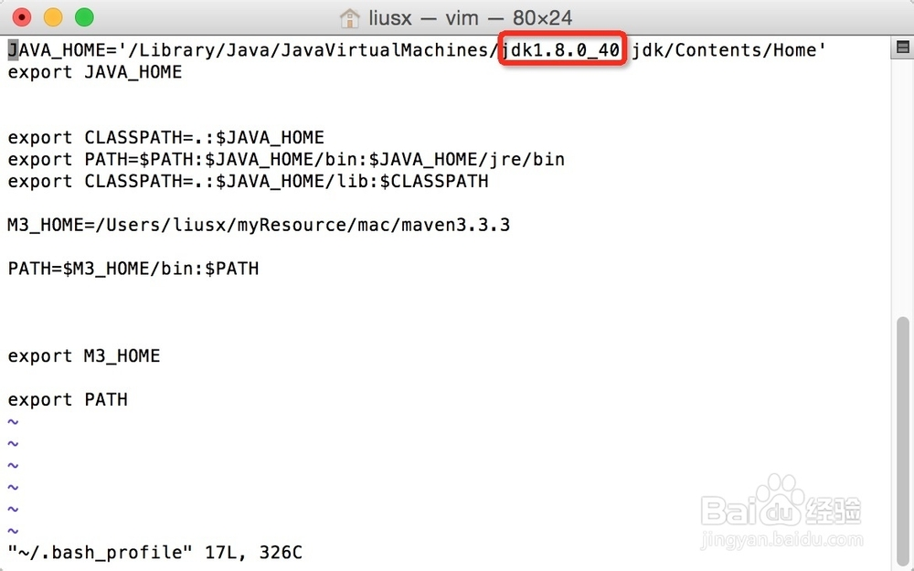
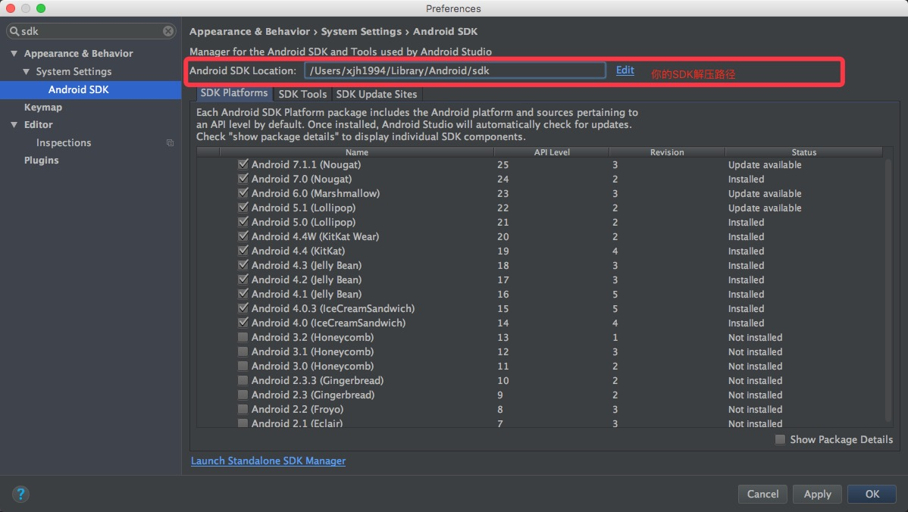
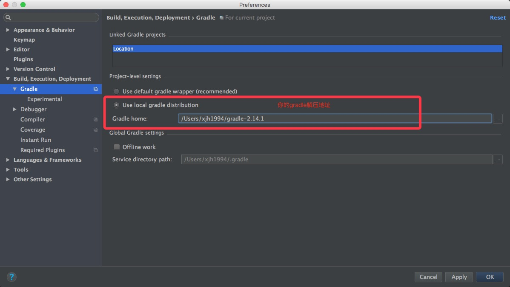
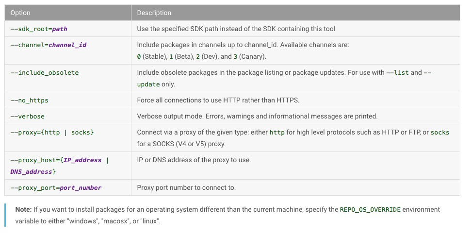

# DEAB
Development Environment Auto Build

开发环境自动搭建

> 人生苦短，不要把时间浪费在搭环境上！

## Android

> JDK-1.8 + AndroidStudio-2.3.0 + Gradle-3.1.4 + Genymotion-2.8.1（均为64位）

### 1、AndroidStudio（For Mac）

#### Usage:

```  bash
git clone https://github.com/xjh1994/DEAB.git

cd DEAB

sudo chmod +x ./android.sh

./android.sh

// 等待控制台下载文件

// 依次安装JDK、JRE、AndroidStudio、Genymotion，配置环境变量

// 解压sdk.zip、gradle.zip

// 打开AndroidStudio，配置SDK路径和Gradle路径

// Done!

```

##### 环境变量设置

设置JAVA_HOME `vim ~/.bash_profile`



保存生效 `source ~/.bash_profile`

##### AndroidStudio配置





### 2、AndroidStudio（For Windows）

#### 下载源代码到本地

#### **以管理员身份**运行 `android.bat`

（下载文件默认保存在C盘下，保证C盘有足够空间（1G），安装完后可以删除）

#### 安装JDK

1、在系统变量里点击新建，变量名填写 `JAVA_HOME` ，变量值填写JDK的安装路径，在这里就填写“你的JDK安装路径”（如 `C:\Program Files\Java\jdk1.6.0_26` ）了。


2、在系统变量里点击新建变量名填写 `CLASSPATH` ，变量值填写 `.;%JAVA_HOME%\lib;%JAVA_HOME%\lib\tools.jar` 。注意不要忘记前面的点和中间的分号。


3、在系统变量里找到Path变量，这是系统自带的，不用新建。双击 `Path` ，由于原来的变量值已经存在，故应在已有的变量后加上 `;%JAVA_HOME%\bin;%JAVA_HOME%\jre\bin` 。注意前面的分号。


4、输入 `java` 和 `javac` 测试是否配置成功

#### 安装AndroidStudio

双击图标安装AndroidStudio，完成后打开；
根据安装时选择的SDK路径，在Preference里配置好AS的SDK路径；
解压下载好的gradle.zip，在AndroidStudio配置中修改默认的Gradle home路径（防止AS去下载gradle导致卡死）

#### Done！

### 3、CommandLine（For Mac）

#### Usage：
[sdkmanager](https://developer.android.google.cn/studio/command-line/sdkmanager.html)

You can use the sdkmanager to perform the following tasks.

##### List installed and available packages
`sdkmanager --list [options]`

##### Install packages
`sdkmanager packages [options]`

The packages argument is an SDK-style path as shown with the --list command, wrapped in quotes (for example, "**build-tools;25.0.2**" or "**platforms;android-25**"). You can pass multiple package paths, separated with a space, but they must each be wrapped in their own set of quotes.

For example, to get **adb** and **fastboot**, install the latest platform tools:

`sdkmanager "platforms;android-25"`

Alternatively, you can pass a text file that specifies all packages:

`sdkmanager --package_file=package_file [options]`

The **package_file** argument is the location of a text file in which each line is an SDK-style path of a package to install (without quotes).

To uninstall, simply add the **--uninstall** flag:

```
sdkmanager --uninstall packages [options]
sdkmanager --uninstall --package_file=package_file [options]
```

##### Update all installed packages
`sdkmanager --update [options]`

##### Options

The following table lists the available options for the above commands.

